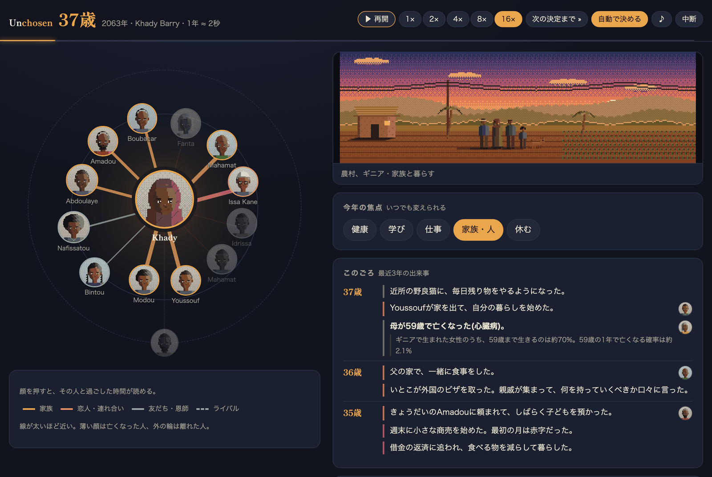
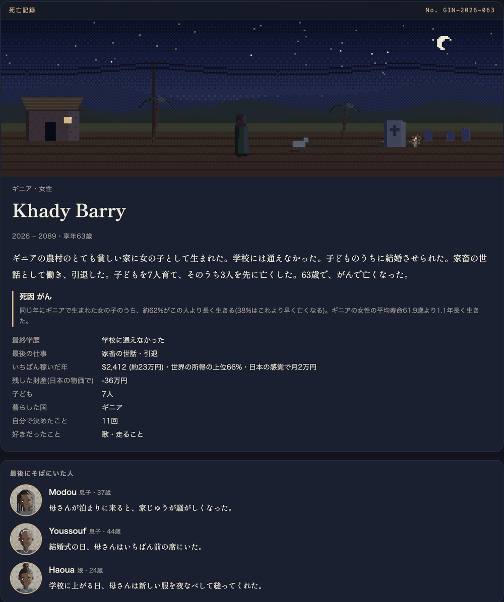
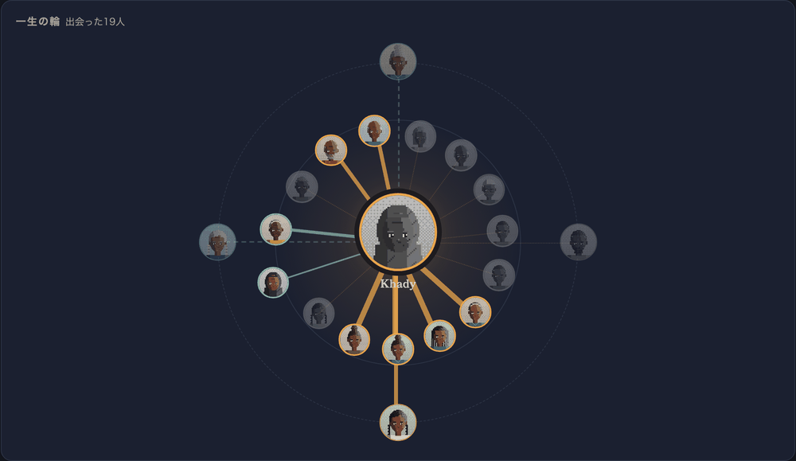

# Unchosen

[English](README.md) | 日本語

**生まれは、選べない。**

世界のどこかに生まれた1人として、一生を1年ずつ最後まで生きるシミュレーションです。どの国のどんな家に生まれるか、その後に何が起きるかの大半は、162か国の実際の統計から引きます。途中でいくつかは自分で選べますが、残りは、たまたま生まれた場所が決めます。



## ある一生を、始まりから終わりまで

上の画面は、37歳の Khady Barry です。2026年にギニアの農村の、とても貧しい家に生まれました。周りに並んでいるのは、彼女の人生にいる人たちです。家族は琥珀色、友だちは緑、連れ合いは薔薇色の線でつながっています。線が太いほど近い間柄で、薄くなった顔はもう亡くなった人です。

この年、母が59歳で亡くなりました。その出来事の下に、それが珍しいことではなかった理由が一行で添えられます。

> ギニアで生まれた女性のうち、59歳まで生きるのは約70%。59歳の1年で亡くなる確率は約2.1%

彼女は学校に通えず、子どものうちに結婚させられました。家畜の世話をして働き、7人の子を育て、そのうち3人を先に亡くしました。そして63歳で、がんで亡くなりました。一生が終わると死亡記録が残ります。最後にそばにいた人たちが、それぞれ自分の側から見た一言を残します。

<p align="center"></p>

## 遊べること

**人の輪。** 親、きょうだい、恋人や連れ合い、子ども、友だち、恩師、ライバル、昔の恋人、孫の一人ひとりに、名前と顔と、0〜100の近さがあります。一緒に過ごした出来事で、近さは上がったり下がったりします。けんかと仲直り、結婚式、何年も連絡を取らない時期、年老いた親の世話などです。顔を押すと、その人と過ごした時間をすべて読めます。最後には一生の輪をまとめて見られます。

<p align="center"></p>

**なぜ起きたか。** 大きな出来事には、その人に効いた数字が一行で付きます。

- 死別には、その年齢での死亡率が付きます。
- 学校を早く離れたときは、次の4つです。家の暮らし向きが国の中で何番目か、国の平均の就学年数、農村で育ったか、女の子が学校に行かせてもらいにくい国か。
- 大学の合否には、実際の合格の見込みが付きます。

小さな出来事には、世界全体の統計の注釈が付くこともあります(1年に洪水などの災害にあう人の数など)。

**その場で描くピクセルアート。** 場面はその人生から描きます。

- 村か町か
- 家か集合住宅か
- 時刻と季節
- 一緒に暮らしている人
- その年を過ごした場所(畑、工場、事務所、露店、病院、お墓)

顔は48×56ピクセルで、髪型は17種類です。家族は似た顔になります。


**同じ1秒に生まれた人たち。** 同じ瞬間に別の国で生まれた4人の一生が、横で同時に進みます。死亡記録では、自分を含む5人が亡くなった年齢の順に並びます。

**追悼館。** 終わった一生は、プレイヤーの一言と一緒に残ります。ほかの人の一生を読んで、ろうそくを灯せます。

**日本語と英語。** 画面の右上で切り替えられます。

## AIで人生を広げる(任意)

一生の骨格は統計のままです(生死、所得、学歴、結婚、出産)。その上で、LLM に書かせられるものがあります。

- 小さな出来事
- 人の輪の誰かとの場面
- その場かぎりの決断
- 亡くなったあとの短い物語

使い方:

- OpenRouter か、OpenAI 互換の手元の LLM(LM Studio、Ollama、mlx など)を使えます。
- 設定はトップ画面の「AIで人生を広げる」で行います。
- APIキーはブラウザにだけ保存されます。サーバが中継するときも、キーはその場で LLM に渡すだけで、記録しません。
- AIの出力は検査してから使います。次の出来事は捨てます。
  - 誰かを死なせる
  - 主人公を結婚させる
  - 亡くなった人を家に戻す
  - 統計と矛盾する

## 動かし方

Node.js 22.13 以降が必要です(`node:sqlite` を使います。26 で試しています)。

```sh
npm install
npm run dev      # http://localhost:5173 (API サーバは 8787 番で同時に起動します)
```

本番用:

```sh
npm run build
npm start        # http://localhost:8787 で dist/ と API を配ります
```

| 環境変数 | 既定 | 意味 |
|---|---|---|
| `PORT` | `8787` | サーバのポート |
| `AI_PRIVATE_RELAY` | `on` | `off` にすると、AI の中継先を OpenRouter と OpenAI に限り、手元や LAN 内の LLM への中継を止めます。インターネットに公開するときは `off` にしてください |

追悼館のデータは `data/memorial.db`(SQLite)に保存されます。

## データと仕組み

国ごとの統計は [Our World in Data](https://ourworldindata.org/)(CC BY 4.0)から取っています。もとは国連、世界銀行、WHO、UNICEF、ILO、UNODC、IHME、World Happiness Report などのデータです。2024年以前の最新の値を使い、欠けている値は同じ地域で所得の近い国から推計しています。

- **寿命**: 生命表は3つの材料から作ります。乳児死亡率、5歳未満死亡率、ゴンペルツ=メイカム型の死亡率です。それを国の平均寿命に合わせ、年齢帯ごとに補正しています。日本では、90歳・95歳・100歳まで生きる人の割合が、厚労省の生命表と1ポイント以内で合います。
- **所得**: ジニ係数から対数正規分布を作り、生まれた家の所得の位置を引きます。金額は購買力平価(PPP)ドルで表します。
- **確かめ方**: `npm test` で、日本・インド・ナイジェリアの一生を1500人ずつ走らせます。平均寿命、5歳未満の死亡率、18歳未満での結婚の割合を、実際の統計と比べます。

データを作り直すには、次を実行します。

```sh
npm run data:fetch   # data/raw/ に CSV を落とす
npm run data:build   # src/data/countries.json を作る
```

これは統計から作った「ありうる一生」で、特定の誰かの人生ではありません。名前、都市、出来事は作りものです。

韓国のウェブゲーム「80억 분의 1(80億分の1)」に触発されて作りました。本家とは関係のない、独立したプロジェクトです。

## ライセンス

[MIT](LICENSE)。統計データには Our World in Data の CC BY 4.0 が適用されます。
