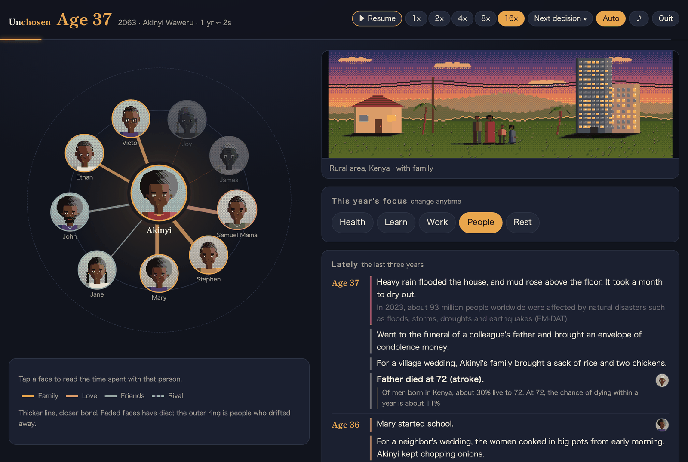
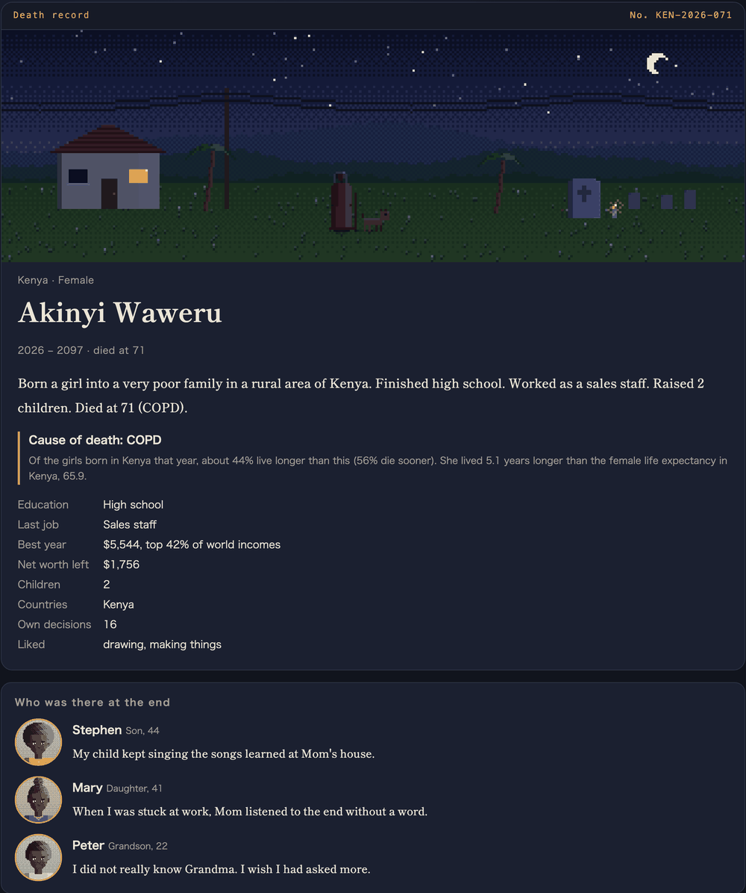
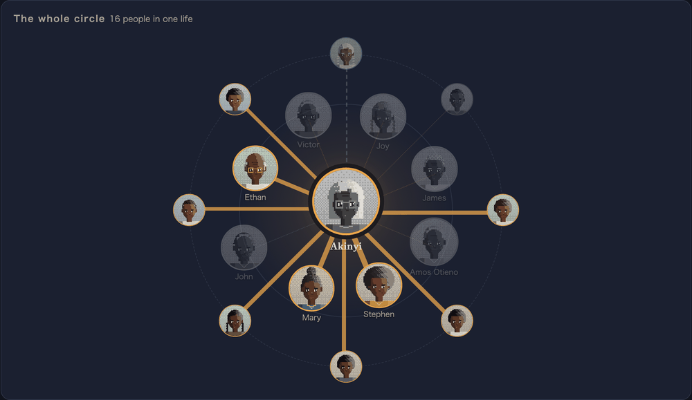
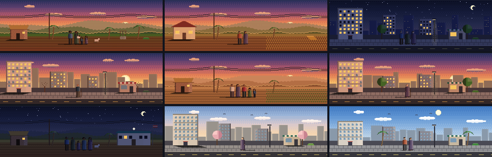

# Unchosen

English | [日本語](README.ja.md)

**You don't choose where you're born.**

Unchosen is a life simulator. You are born as one person somewhere in the world and live that life to the end, one year at a time. The country, the family and most of what happens are drawn from real statistics for 162 countries. You get to choose a few things along the way. The rest is decided by where you happened to land.



## One life, start to finish

The screenshot above is Akinyi Waweru at 37. She was born in 2026 into a very poor family in rural Kenya. Around her are the people in her life. Family are amber, friends green, her partner rose. A thicker line means a closer bond, and the faded faces are people who have died.

This year her father died at 72. Under the entry, the game says why that was not surprising:

> Of men born in Kenya, about 30% live to 72. At 72, the chance of dying within a year is about 11%.

She finished high school, worked in sales, raised two children and died at 71 of COPD. When a life ends, it becomes a death record. The people who were closest at the end each leave a line, written from their side of the relationship:

<p align="center"></p>

## What's in it

**A circle of people.** Parents, siblings, partners, children, friends, mentors, rivals, exes and grandchildren all have a name, a face and a bond from 0 to 100. Shared moments move the bond up or down: a fight, making up, a wedding, years without a call, looking after a parent who is getting old. Tap a face to read everything you went through together. At the end you can see the whole circle at once.

<p align="center"></p>

**Why it happened.** Big events carry a line about the numbers behind them, for this particular person. For a death, that is the age-specific risk. For leaving school early, it is the family's income rank, the country's average years of schooling, a rural childhood, and whether girls are kept in school there. For a university result, it is the actual odds of getting in. Smaller events sometimes carry a note on the global picture, such as how many people are affected by floods in a year.

**Pixel art drawn on the fly.** Every scene is generated from the life: village or city, house or apartment block, time of day, season, who is living with you, and where the year was spent (a field, a factory, an office, a market stall, a hospital, a grave). Portraits are 48×56 pixels with 17 hairstyles, and family members share features.



**Born in the same second.** Four other people are born at the same moment in other countries. Their lives run alongside yours, and the death record lists all five by how long they lived.

**Memorial.** Finished lives are kept with a short word from the player. You can read other people's lives and light a candle for them.

**Japanese and English.** Switch in the top right corner.

## Let an AI fill in the details (optional)

The skeleton of a life stays statistical: survival, income, education, marriage and children. On top of it, an LLM can write small events, scenes with the people in the circle, one-off decisions, and a short story after death.

- Works with OpenRouter or any local OpenAI-compatible server (LM Studio, Ollama, mlx and others).
- Set it up under "Expand lives with AI" on the top screen.
- The API key is stored only in your browser. When the server relays requests, it passes the key to the LLM and does not record it.
- AI output is checked before use. An event is thrown away if it kills someone, marries the character off, puts a dead person back in the house or contradicts the statistics.

## Running it

Requires Node.js 22.13 or later (it uses `node:sqlite`; tested on 26).

```sh
npm install
npm run dev      # http://localhost:5173 (the API server starts on port 8787 too)
```

For production:

```sh
npm run build
npm start        # serves dist/ and the API on http://localhost:8787
```

| Variable | Default | Meaning |
|---|---|---|
| `PORT` | `8787` | Server port |
| `AI_PRIVATE_RELAY` | `on` | Set to `off` to relay AI requests only to OpenRouter and OpenAI, never to local or LAN servers. Use `off` when the server is exposed to the internet |

Memorial entries are stored in `data/memorial.db` (SQLite).

## Data and how it works

Country statistics come from [Our World in Data](https://ourworldindata.org/) (CC BY 4.0), which compiles data from the UN, the World Bank, WHO, UNICEF, ILO, UNODC, IHME, the World Happiness Report and others. The latest value up to 2024 is used. Missing values are estimated from countries in the same region with similar income.

- **Lifespan**: a life table built from infant and under-5 mortality plus a Gompertz-Makeham hazard, fitted to each country's life expectancy and calibrated by age band. For Japan, the share of people who reach 90, 95 and 100 is within one percentage point of the official life table.
- **Income**: a log-normal distribution derived from the Gini coefficient. Your family's position in it is drawn at birth. Amounts are in purchasing-power-parity (PPP) dollars.
- **Checks**: `npm test` runs 1,500 lives each in Japan, India and Nigeria and compares average lifespan, under-5 mortality and the share of child marriage with the real figures.

To rebuild the data:

```sh
npm run data:fetch   # downloads CSVs into data/raw/
npm run data:build   # writes src/data/countries.json
```

These are plausible lives built from statistics, not the lives of real people. Names, cities and events are made up.

Inspired by the Korean web game "80억 분의 1" (1 in 8 billion). This is an independent project with no connection to the original.

## License

[MIT](LICENSE). The statistical data is under Our World in Data's CC BY 4.0.
